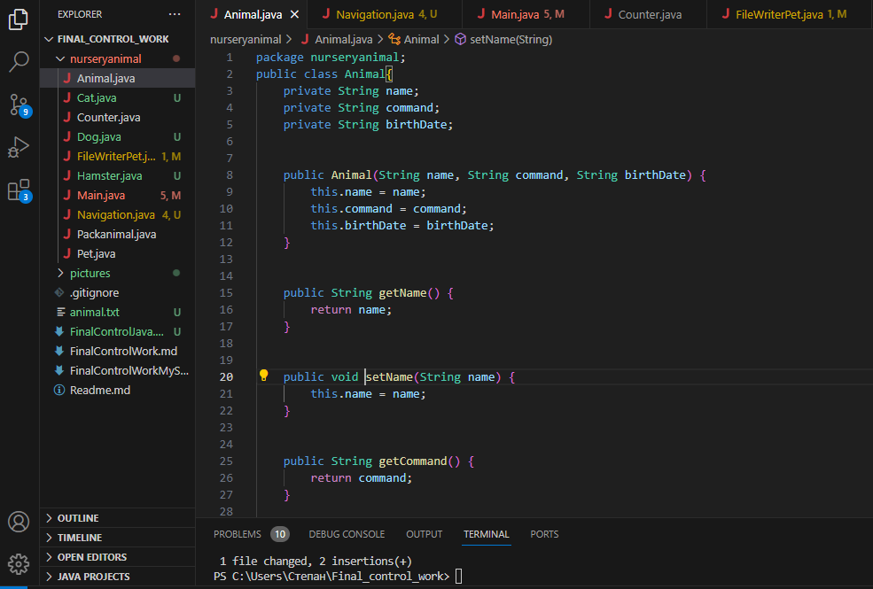
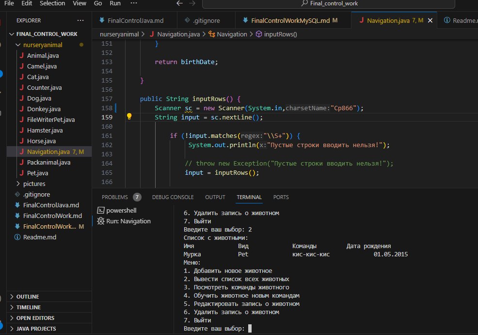

13. Создать класс с Инкапсуляцией методов и наследованием по диаграмме.

14. Написать программу, имитирующую работу реестра домашних животных.
В программе должен быть реализован следующий функционал:

        14.1. Завести новое животное;
        14.2. определять животное в правильный класс;
        14.3. увидеть список команд, которое выполняет животное;
        14.4. обучить животное новым командам;
        14.5. Реализовать навигацию по меню.

15.  Создайте класс Счетчик, у которого есть метод __add()__, увеличивающий̆
значение внутренней̆int переменной на 1 при нажатие __“Завести новое животное”__ Сделайте так, чтобы с объектом такого типа можно было работать в
блоке __try-with-resources__. Нужно бросить исключение, если работа с объектом
типа счетчик была не в ресурсном __try__ и/или ресурс остался открыт. Значение
считать в ресурсе __try__, если при заведения животного заполнены все поля.

