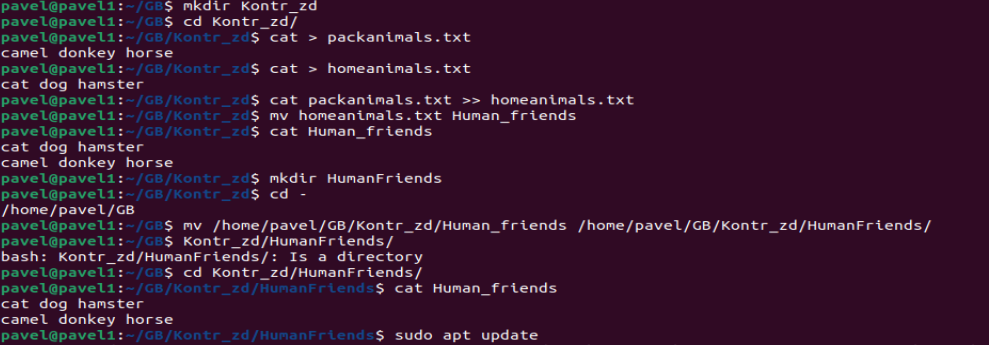
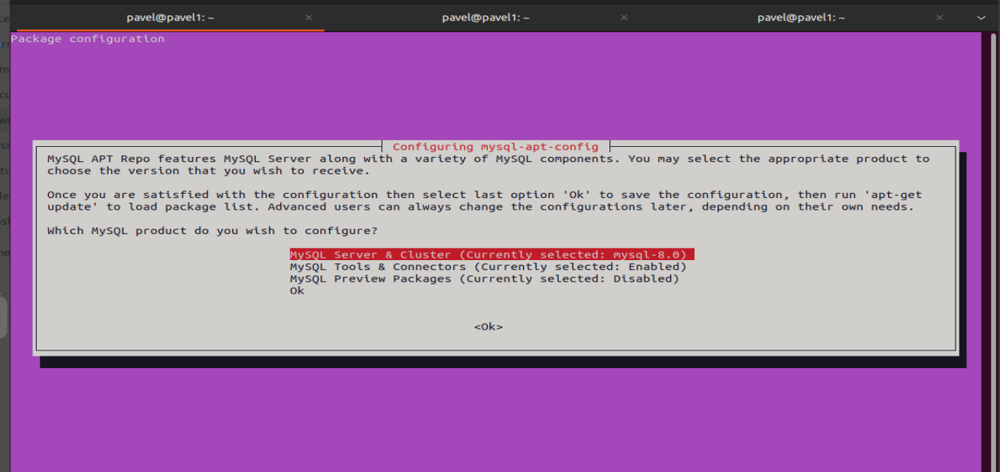
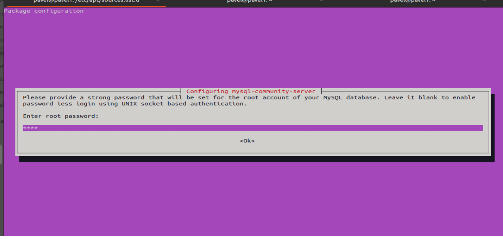
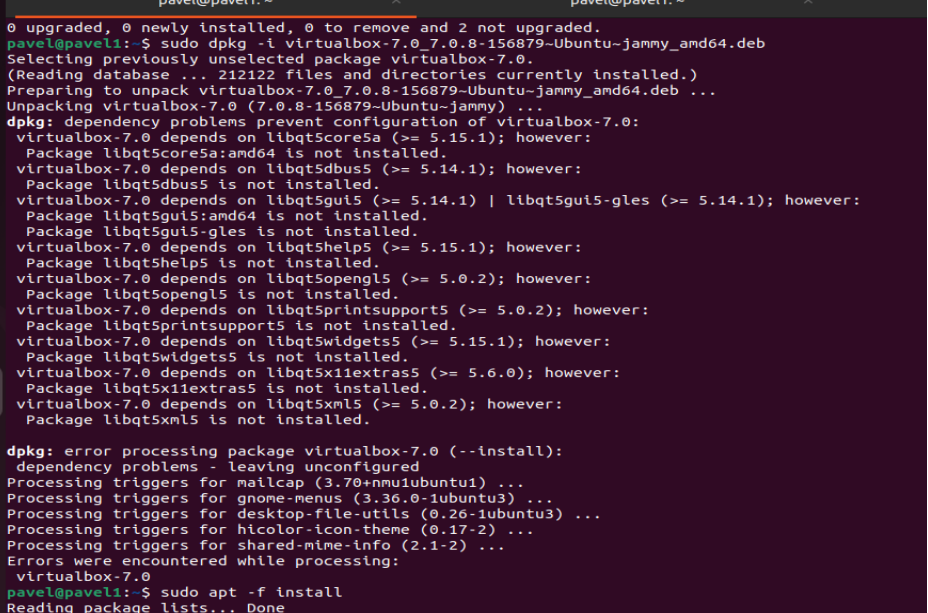
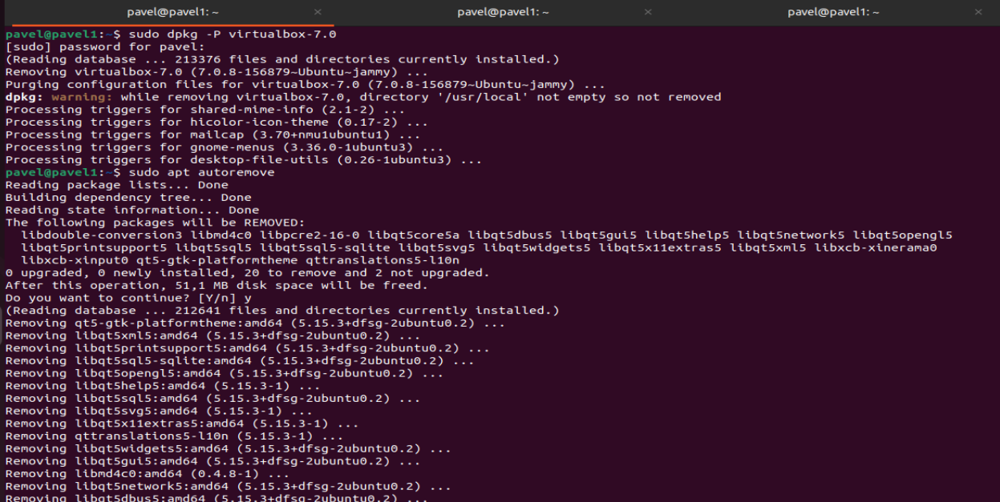

# Итоговая контрольная работа

## Решение

1 Используя команду cat в терминале операционной системы Linux, создать два файла:Домашние животные (заполнив файл собаками, кошками,
хомяками) и Вьючные животными (заполнив файл лошадьми, верблюдами и ослами). 
Затем объединить их. Просмотреть содержимое созданного файла. Переименовать файл, дав ему новое имя (Друзья человека).

* Создаём для  итоговой контольной работы директорию __Kontr_zd__ и заходим в неё.
Потом создаём два файла: packanimals.txt(собаками, кошками,
хомяками), homeanimal.txt (лошадьми, верблюдами и ослами) 
Объединяем два файла в homeanimal.txt просматриваем и переименоваем в HumanFriends и также просматриваем результат.

      mkdir Kontr_zd
      cd Kontr_zd/
      cat > packanimals.txt
      cat > homeanimal.txt 
      cat packanimals.txt >> homeanimal.txt 
      cat  homeanimal.txt
      mv homeanimal.txt HumanFriends
      cat HumanFriends 

2 Создать директорию, переместить файл туда.
* Создаём новую директорию с именем HumanFriends.
  Перемещаем файл HumanFriends.txt в директорию HumanFriends и просматриваем полученный результат

     mkdir HumanFriends
     mv /home/pavel/Kontr_zd/HumanFriends /home/pavel/HumanFriends/HumanFriends
     cd /home/pavel/HumanFriends/
     cat HumanFriends 

3 Подключить дополнительный репозиторий MySQL.  Установить любой пакет из этого репозитория.

Перед установкой дополнительного репозитория __MySQL__
необходимо обновить пакеты __ubuntu__

    sudo apt update

Скачаем репозиторий MySQL
     
      sudo dpkg -i ~/Downloads/mysql-apt-config_0.8.26-1_all.deb

Устанавливаем 

    sudo apt install mysql-server mysql-client

Подверждаем настройки по умолчанию

Придумаем пароль

Процесс распаковки файлов MySQL

После установки пакетов MySQL проверяем статус 

    sudo service mysql status

4 Установить и удалить deb-пакет с помощью dpkg.
 
 Для примера возьмём deb-пакет virtualbox-7.0_7.0
Скачаем его утилитой __wget__ по адресу:

    wget https://download.virtualbox.org/virtualbox/7.0.8/virtualbox-7.0_7.0.8-156879~Ubuntu~jammy_amd64.deb

Установим его

    sudo dpkg -i virtualbox-7.0_7.0.8-156879~Ubuntu~jammy_amd64.deb

При распокавки файлов virtualbox-7.0_7.0 выведится на экран ошибка, сообщающая о том, что virtualbox-7.0_7.0 установлен с ошибкой, не все зависимости установились автоматически. Поэтому для полной устоновки набираем команду 

    sudo apt -f install

Deb-пакет установлен, теперь его можно и удалить.

    sudo dpkg -P virtualbox-7.0

Удаляем все зависимости virtualbox-7.0 и обновляем ubuntu

    sudo apt autoremove
    sudo apt upgrade

5 Выложить историю команд в терминале ubuntu.
 
История команд 

      mkdir Kontr_zd
      cd Kontr_zd/
      cat > packanimals.txt
      cat > homeanimal.txt 
      cat packanimals.txt >> homeanimal.txt 
      cat  homeanimal.txt
      mv homeanimal.txt HumanFriends
      cat HumanFriends
      mkdir HumanFriends
      mv /home/pavel/Kontr_zd/HumanFriends /home/pavel/HumanFriends/HumanFriends
      cd /home/pavel/HumanFriends/
      cat HumanFriends 
      sudo apt update
      sudo dpkg -i ~/Downloads/mysql-apt-config_0.8.26-1_all.deb
      sudo apt install mysql-server mysql-client
      sudo service mysql status
      wget https://download.virtualbox.org/virtualbox/7.0.8/virtualbox-7.0_7.0.8-156879~Ubuntu~jammy_amd64.deb
      sudo dpkg -i virtualbox-7.0_7.0.8-156879~Ubuntu~jammy_amd64.deb
      sudo apt -f install
      sudo dpkg -P virtualbox-7.0
      sudo apt autoremove
      sudo apt upgrade
      history 

 
6  Нарисовать диаграмму, в которой есть класс родительский класс, домашние животные и вьючные животные, в составы которых в случае домашних животных войдут классы: собаки, кошки, хомяки, а в класс вьючные животные войдут: Лошади, верблюды и ослы.

7  В подключенном MySQL репозитории создать базу данных “Друзья человека”.
