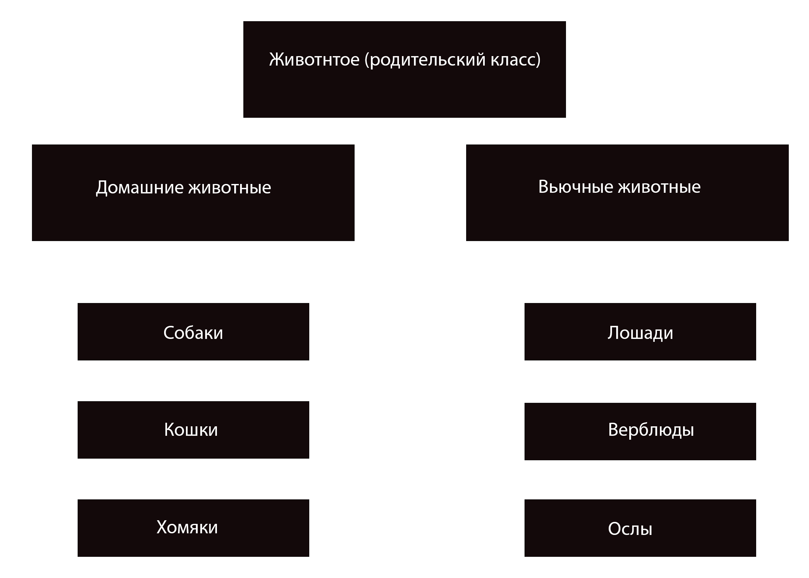
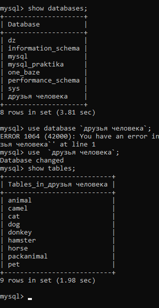
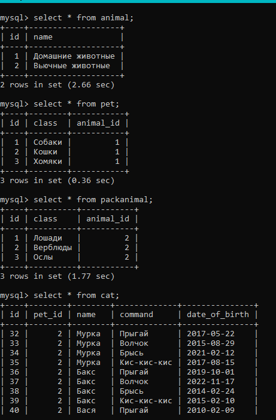

# Итоговая контрольная работа, часть вторая

## MySQL

6 Нарисовать диаграмму, в которой есть класс родительский класс, домашние животные и вьючные животные, в составы которых в случае домашних животных войдут классы: собаки, кошки, хомяки, а в класс вьючные животные войдут: Лошади, верблюды и ослы.

 

7  В подключенном MySQL репозитории создать базу данных “Друзья человека”.

 Создаём базу данных и заходим в неё

        mysql> CREATE DATABASE `Друзья человека`;
        mysql> use `друзья человека`;

8  Создать таблицы с иерархией из диаграммы в БД.

 Создаём родительскую таблицу __Animal__. 

        mysql> create table Animal (
         -> id INT PRIMARY KEY AUTO_INCREMENT, name VARCHAR(40));

Создание таблицы "Домашние животные"( __Pet__ )с внешним ключом, наследующий от таблицы Animal.

        mysql> create table Pet (
        -> id INT PRIMARY KEY AUTO_INCREMENT, class VARCHAR(40),
         -> animal_id INT,
         -> FOREIGN KEY (animal_id) REFERENCES animal(id));
    
Создание таблицы "Вьючные животные"( __PackAnimal__ ) с внешним ключом, наследующий от таблицы Animal.

        mysql> create table PackAnimal (
        -> id INT PRIMARY KEY AUTO_INCREMENT, class VARCHAR(40),
        -> animal_id INT,
        -> FOREIGN KEY (animal_id) REFERENCES animal(id));

 Создание таблиц "Собаки", "Кошки", "Хомяки" с внешним ключом, наследующий от таблицы "Домашние животные":

__Кошки__

        mysql> create table cat (
         -> id INT PRIMARY KEY AUTO_INCREMENT, pet_id INT,
         -> name VARCHAR(40),
          -> command VARCHAR(40),
         -> date_of_birth DATE,
         -> FOREIGN KEY (pet_id) REFERENCES pet(id));

__Собаки__ 

        mysql> create table dog (
         -> id INT PRIMARY KEY AUTO_INCREMENT, pet_id INT,
         -> name VARCHAR(40),
         -> command VARCHAR(40),
         -> date_of_birth DATE,
         -> FOREIGN KEY (pet_id) REFERENCES pet(id));

__Хомяки__

    mysql> create table hamster (
    -> id INT PRIMARY KEY AUTO_INCREMENT, pet_id INT,
    -> name VARCHAR(40),
    -> command VARCHAR(40),
    -> date_of_birth DATE,
    -> FOREIGN KEY (pet_id) REFERENCES pet(id));

Создание таблиц "Лошади", "Верблюды", "Ослы" с внешним ключом, наследующий от таблицы "Вьючные животные":

__Лошади__

    mysql> create table horse (
    -> id INT PRIMARY KEY AUTO_INCREMENT, packanimal_id INT,
    -> name VARCHAR(40),
    -> command VARCHAR(40),
    -> date_of_birth DATE,
    -> FOREIGN KEY (packanimal_id) REFERENCES packanimal(id));

__Верблюды__

    mysql> create table camel (
    -> id INT PRIMARY KEY AUTO_INCREMENT, packanimal_id INT,
    -> name VARCHAR(40),
    -> command VARCHAR(40),
    -> date_of_birth DATE,
    -> FOREIGN KEY (packanimal_id) REFERENCES packanimal(id));  

__Ослы__ 

       mysql> create table donkey (
    -> id INT PRIMARY KEY AUTO_INCREMENT, packanimal_id INT,
    -> name VARCHAR(40),
    -> command VARCHAR(40),
    -> date_of_birth DATE,
    -> FOREIGN KEY (packanimal_id) REFERENCES packanimal(id)); 

Проверяем созданную БД:

        mysql> SHOW DATABASES;
        mysql> SHOW TABLE;

9 Заполнить низкоуровневые таблицы именами(животных), командами, которые они выполняют, и датами рождения Прежде, чем заполнять низкоуровнневые таблицы, заполним родительские: "Домашние животные" и "Вьючные животные"

 "Домашние животные"      __Pet__

    mysql> INSERT INTO pet(class, animal_id)
    -> values ("Собаки", 1),
    -> ("Кошки", 1),
    ->  ("Хомяки", 1);

"Вьючные животные"     __PackAnimal__

    mysql> insert into  packanimal(class, animal_id)
    -> values ("Лошади", 2),
    -> ("Верблюды", 2),
    -> ("Ослы", 2);

Заполним низкоуровнивые таблицы данными:

Таблица "__Собаки__":

    mysql> INSERT INTO dog (pet_id, name, command,  date_of_birth)
    -> SELECT p.id, n.name, c.command, DATE_ADD('2008-01-01', INTERVAL FLOOR(RAND() * 10000) DAY)
    -> FROM pet AS p
    -> CROSS JOIN (
    -> SELECT "Лео" AS name UNION ALL
    -> SELECT "Шарик" UNION ALL
    -> SELECT "Вуд"  UNION ALL
    -> SELECT "Венера"  UNION ALL
    -> SELECT "Лунна"  UNION ALL
    -> SELECT "Ричард" )
    -> AS n
    -> CROSS JOIN (
    -> SELECT 'Ко мне' AS command UNION ALL
    -> SELECT 'Апорт'  UNION ALL
    -> SELECT 'Рядом'  UNION ALL
    -> SELECT 'Голос'  UNION ALL
    -> SELECT 'Сидеть'  UNION ALL
    -> SELECT 'Вперёд')
    -> AS c
    -> WHERE p.class = 'Собаки';

Таблица "__Кошки__":

    mysql> INSERT INTO cat (pet_id, name, command, date_of_birth)
    -> SELECT p.id, n.name, c.command, DATE_ADD('2005-01-01', INTERVAL FLOOR(RAND() * 10000) DAY)
    -> FROM pet AS p
    -> CROSS JOIN (
    -> SELECT "Мурка" AS name UNION ALL
    -> SELECT "Бакс" UNION ALL
    -> SELECT "Вася"  UNION ALL
    -> SELECT "Барсик"  UNION ALL
    -> SELECT "Марс" )
    -> AS n
    -> CROSS JOIN (
    -> SELECT 'Кис-кис-кис' AS command UNION ALL
    -> SELECT 'Брысь'  UNION ALL
    -> SELECT 'Волчок'  UNION ALL
    -> SELECT 'Прыгай' )
    -> AS c
    -> WHERE p.class = 'Кошки';

Таблица "__Хомяки__":

    mysql> INSERT INTO hamster (pet_id, name, command,  date_of_birth)
    -> SELECT p.id, n.name, c.command, DATE_ADD('2013-01-01', INTERVAL FLOOR(RAND() * 10000) DAY)
    -> FROM pet AS p
    -> CROSS JOIN (
    -> SELECT "Хоря" AS name UNION ALL
    -> SELECT "Шустрик"  UNION ALL
    -> SELECT "Непоседа"  UNION ALL
    -> SELECT "Рики"  UNION ALL
    -> SELECT "Хвостик"  UNION ALL
    -> SELECT "Нэлли"  )
    -> AS n
    -> CROSS JOIN (
    -> SELECT 'Прыжок' AS command UNION ALL
    -> SELECT "Кувырок"  UNION ALL
    -> SELECT "Стоять"  UNION ALL
    -> SELECT "Нельзя" )
    -> AS c
    -> WHERE p.class = 'Хомяки';

Таблица "__Лошади__":

     mysql> INSERT INTO horse (packanimal_id, name, command,  date_of_birth)
    -> SELECT pa.id, n.name, c.command, DATE_ADD('2000-01-01', INTERVAL FLOOR(RAND() * 10000) DAY)
    -> FROM packanimal AS pa
    -> CROSS JOIN (
    -> SELECT "Дымка" AS name UNION ALL
    -> SELECT "Граф"  UNION ALL
    -> SELECT "Зорька"  UNION ALL
    -> SELECT "Ворон"  UNION ALL
    -> SELECT "Ласточка" )
    -> AS n
    -> CROSS JOIN (
    -> SELECT 'Стой' AS command UNION ALL
    -> SELECT "Вперёд"  UNION ALL
    -> SELECT "Хоп"  UNION ALL
    -> SELECT "Шагом"  UNION ALL
    -> SELECT "Но, пошла!" )
    -> AS c
    -> WHERE pa.class = 'Лошади';

Таблица "__Верблюды__":

    mysql>INSERT INTO camel (packanimal_id, name, command,  date_of_birth)
    -> SELECT pa.id, n.name, c.command, DATE_ADD('2000-01-01', INTERVAL ( SELECT(FLOOR(RAND() * DATEDIFF('2023-01-01','2000-01-01')))) DAY)
    -> FROM packanimal AS pa
    -> CROSS JOIN (
    -> SELECT "Агата" AS name UNION ALL
    -> SELECT "Чайна"  UNION ALL
    -> SELECT "Марта"  UNION ALL
    -> SELECT "Ида" )
    -> AS n
    -> CROSS JOIN (
    -> SELECT 'Стой' AS command UNION ALL
    -> SELECT "Вперёд"  UNION ALL
    -> SELECT "За мной"  UNION ALL
    -> SELECT "Лежать")
    -> AS c
    -> WHERE pa.class = 'Верблюды';

Таблица "__Ослы__":

    mysql> INSERT INTO donkey (packanimal_id, name, command,  date_of_birth)
    -> SELECT pa.id, n.name, c.command, DATE_ADD('2008-01-01', INTERVAL ( SELECT(FLOOR(RAND() * DATEDIFF('2023-01-01','2008-01-01')))) DAY)
    -> FROM packanimal AS pa
    -> CROSS JOIN (
    -> SELECT "Вольт" AS name UNION ALL
    -> SELECT "Дюк"  UNION ALL
    -> SELECT "Мэтью"  UNION ALL
    -> SELECT "Шкипер"  UNION ALL
    -> SELECT "Скуби" )
    -> AS n
    -> CROSS JOIN (
    -> SELECT 'Стой' AS command UNION ALL
    -> SELECT "Вперёд"  UNION ALL
    -> SELECT "За мной"  UNION ALL
    -> SELECT "Лежать")
    -> AS c
    -> WHERE pa.class = 'Ослы';

Проверяем заполнение таблиц.

10. Удалив из таблицы верблюдов, т.к. верблюдов решили перевезти в другой питомник на зимовку. Объединить таблицы лошади, и ослы в одну таблицу.